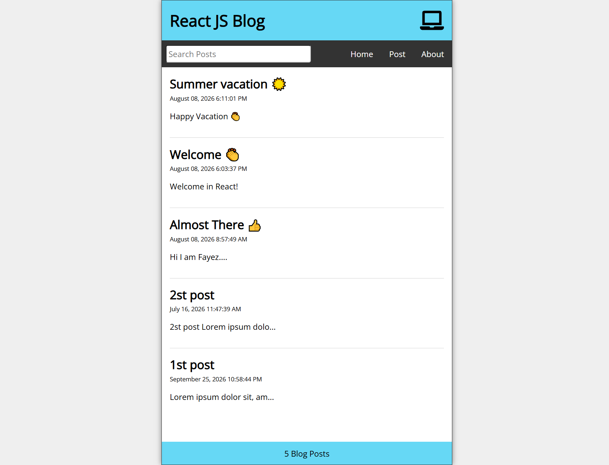

# React JS Blog Application 🚀

A modern, fully responsive blog application built with React.js. This project allows users to create, read, update, and delete blog posts (Full CRUD operations) with a clean and interactive user interface. It also features a real-time search functionality to filter posts instantly.

> **Note:** This project was built as part of my React learning journey, applying core concepts like State Management, Hooks, and Component-based architecture.

---

## 📸 Project Interface

---

## 🎥 Video Demonstration

Here is a quick 1-minute video showcasing the UI, CRUD operations, real-time search, and the responsive design:

> **Click on the image above to watch the video demo on YouTube.**

---

## ✨ Key Features

- **Full CRUD Operations:** Seamlessly Create, Read, Update, and Delete posts using JSON Server.
- **Real-time Search:** Filter and find posts instantly as you type.
- **Responsive Design:** Adaptive UI that looks great on Desktop, Tablet, and Mobile devices.
- **Dynamic State Management:** Utilizing React Hooks for efficient data handling.
- **Modern UI:** Clean, minimalistic, and user-friendly design.

---

## 🛠️ Technologies Used

- **React.js** (Hooks, Functional Components)
- **JSON Server** (Fake REST API)
- **JavaScript (ES6+)**
- **CSS3 / HTML5**

---

## 🚀 How to Run the Project Locally

If you'd like to test the app on your local machine, follow these steps:

1. **Clone the repository:** `git clone [https://github.com/fz-mk/react-blog-app]`
2. **Navigate to the project directory:** `cd [Your-Repository or Folder Name] `
3. **Install dependencies:** `npm install`
4. **Start the JSON Server (Fake API):** `npx json-server data/db.json --port 3500 ` (Run this in a separate terminal).
5. **Start the development server:** `npm start` (The app will run at `http://localhost:3000`).

---

## 💡 What I Learned

Building this project helped me solidify my understanding of:
- Building reusable UI components.
- Managing application state effectively.
- Implementing CRUD operations using a mock backend (JSON Server).
- Designing fully responsive layouts from scratch.